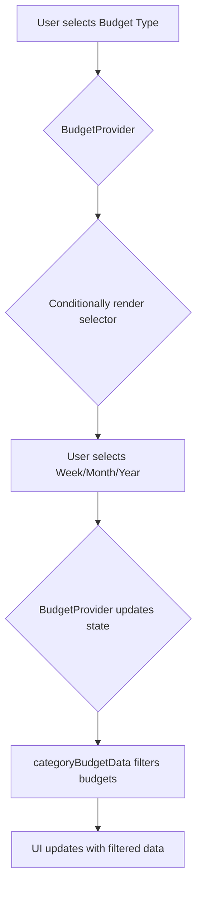

# Budget Refactor Plan

This document outlines the plan to refactor the budget feature to include weekly, monthly, and yearly budget selectors with fixed date ranges.

## 1. Model Changes (`lib/models/budget.dart`)

The `Budget` model is already in good shape, but the week calculation needs to be adjusted to meet the "Sunday to Saturday" requirement.

- **Update `getStartOfWeek`**: Modify this helper to consider Sunday as the first day of the week.
- **Update `getEndOfWeek`**: Modify this helper to consider Saturday as the last day of the week.
- **Update `getWeekNumber`**: Ensure this is compatible with the new Sunday-Saturday week definition.
- **Update `getDateRange` for `BudgetType.weekly`**: This should use the updated `getStartOfWeek` and `getEndOfWeek` to calculate the correct date range.

### Current `getStartOfWeek` (Monday-based)
```dart
static DateTime getStartOfWeek(DateTime date) {
  final daysFromMonday = (date.weekday - DateTime.monday + 7) % 7;
  return DateTime(date.year, date.month, date.day).subtract(Duration(days: daysFromMonday));
}
```

### Proposed `getStartOfWeek` (Sunday-based)
```dart
static DateTime getStartOfWeek(DateTime date) {
  final daysFromSunday = date.weekday % 7;
  return DateTime(date.year, date.month, date.day).subtract(Duration(days: daysFromSunday));
}
```

## 2. Provider/State Management Changes (`lib/viewmodels/budget_provider.dart`)

The `BudgetProvider` needs to be updated to manage the state for the new selectors and to filter the budgets correctly.

- **Add State for Selectors**:
  - `_selectedWeek`: An integer to store the selected week number (1-4).
  - `_selectedMonth`: A `DateTime` to store the selected month.
  - `_selectedYear`: A `DateTime` to store the selected year.

- **Update `addBudget`**:
  - When creating a weekly budget, use the updated `Budget.getDateRange` to ensure the correct Sunday-Saturday date range is assigned.

- **Update `categoryBudgetData` Getter**:
  - This getter needs to be completely reworked to filter budgets based on the `_selectedBudgetType` and the new selector states (`_selectedWeek`, `_selectedMonth`, `_selectedYear`).
  - For `BudgetType.weekly`, it should filter budgets that fall within the selected week of the current month.
  - For `BudgetType.monthly`, it should filter budgets for the `_selectedMonth`.
  - For `BudgetType.yearly`, it should filter budgets for the `_selectedYear`.

- **Add State Management Methods**:
  - `changeSelectedWeek(int week)`
  - `changeSelectedMonth(DateTime month)`
  - `changeSelectedYear(DateTime year)`
  - These methods will update the state and call `notifyListeners()`.

## 3. UI Changes (`lib/screens/dashboard/navbar/budget/budget_screen.dart`)

The `BudgetScreen` will be updated to include the new selectors and to display the filtered budget data.

- **Create New Selector Widgets**:
  - `_buildWeekSelector()`: A widget with chips or a dropdown for "Week 1" to "Week 4".
  - `_buildMonthSelector()`: A widget that allows the user to pick a month (e.g., using a `showDatePicker` dialog).
  - `_buildYearSelector()`: A widget that allows the user to pick a year.

- **Conditionally Render Selectors**:
  - In the `build` method, after `_buildBudgetTypeSelector`, add logic to show the appropriate selector based on `provider.selectedBudgetType`.

- **Connect Selectors to Provider**:
  - The `onTap` or `onChanged` callbacks of the new selectors will call the corresponding methods in the `BudgetProvider` (e.g., `provider.changeSelectedWeek(2)`).

- **Update UI to Display Filtered Data**:
  - The rest of the UI (`_buildPieChart`, `_buildCategoryList`) should automatically update because they use `provider.categoryBudgetData`, which will now return the correctly filtered data.

## 4. Workflow Diagram

This Mermaid diagram illustrates the new data flow for filtering and displaying budgets.



This plan provides a clear path to implementing the requested features. The next step is to switch to `code` mode and start implementing these changes.