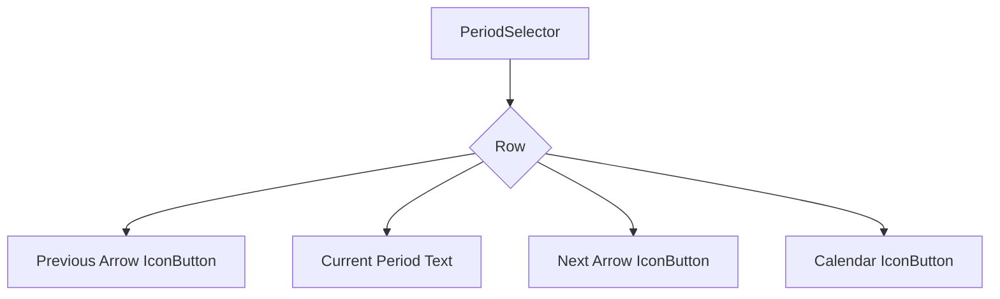

# Period Selector Refactor Plan

This document outlines the plan to refactor the period selectors in the budget screen.

## 1. Design of the New Reusable Period Selector Widget

The new period selector will be a reusable widget named `PeriodSelector`. It will be responsible for displaying the current period and providing navigation controls.

### 1.1. Widget Structure

The widget will be a `Row` containing three main elements:
1.  An `IconButton` for navigating to the previous period.
2.  A `Text` widget to display the currently selected period.
3.  An `IconButton` for navigating to the next period.
4.  An `IconButton` with a calendar icon to open a date picker for quick navigation.

### 1.2. Visual Design

### 1.3. Widget Parameters

The `PeriodSelector` widget will accept the following parameters:

*   `periodText`: The text to display for the current period (e.g., "Week 3", "October 2025", "2025").
*   `onPrevious`: A `VoidCallback` to be executed when the previous arrow is tapped.
*   `onNext`: A `VoidCallback` to be executed when the next arrow is tapped.
*   `onQuickJump`: A `VoidCallback` to be executed when the calendar icon is tapped.

## 2. Plan for `BudgetProvider` Changes

The `BudgetProvider` will need new methods to handle navigation between periods and to manage the state of the currently displayed period.

### 2.1. New Methods

The following methods will be added to `BudgetProvider`:

*   `goToNextWeek()`: Increments `_selectedWeek`. If `_selectedWeek` exceeds the number of weeks in the current month, it will advance to the next month and reset `_selectedWeek` to 1.
*   `goToPreviousWeek()`: Decrements `_selectedWeek`. If `_selectedWeek` goes below 1, it will go to the previous month and set `_selectedWeek` to the last week of that month.
*   `goToNextMonth()`: Advances `_selectedMonth` by one month.
*   `goToPreviousMonth()`: Decreases `_selectedMonth` by one month.
*   `goToNextYear()`: Advances `_selectedYear` by one year.
*   `goToPreviousYear()`: Decreases `_selectedYear` by one year.
*   `setSelectedDate(DateTime date)`: Sets `_selectedMonth` or `_selectedYear` based on the `selectedBudgetType`. For weekly, it will calculate the week of the month for the given date and update `_selectedWeek`.

### 2.2. State Management

*   The `_selectedWeek`, `_selectedMonth`, and `_selectedYear` properties will continue to hold the currently selected period.
*   The `categoryBudgetData` getter will automatically react to changes in these properties, ensuring the displayed budget data is always up-to-date.
*   A new getter, `currentPeriodDisplay`, will be added to `BudgetProvider` to return a formatted string representing the current period (e.g., "Week 3", "October 2025", "2025") based on `_selectedBudgetType` and the corresponding selected period variable.

### 2.3. Helper Methods

*   `_getWeeksInMonth(DateTime month)`: A helper method to calculate the number of weeks in a given month. This will be crucial for `goToNextWeek()` and `goToPreviousWeek()`.
*   `_getWeekOfMonth(DateTime date)`: A helper method to calculate the week number of a given date within its month.

## 3. Plan for UI Implementation in `budget_screen.dart`

The `budget_screen.dart` file will be updated to use the new `PeriodSelector` widget and the new methods in `BudgetProvider`.

### 3.1. Replacing the Old Selector

*   The existing `_buildPeriodSelector`, `_buildWeeklySelector`, `_buildMonthlySelector`, and `_buildYearlySelector` methods will be removed.
*   A new `_buildPeriodSelector` method will be created. This method will return a `PeriodSelector` widget.

### 3.2. Implementing the New `_buildPeriodSelector`

The new `_buildPeriodSelector` method will:

1.  Get the `BudgetProvider` instance.
2.  Determine the appropriate `onPrevious`, `onNext`, and `onQuickJump` callbacks based on the `provider.selectedBudgetType`.
3.  Pass the `provider.currentPeriodDisplay` to the `periodText` parameter of the `PeriodSelector`.
4.  The `onPrevious` and `onNext` callbacks will call the corresponding `goTo...` methods on the provider.
5.  The `onQuickJump` callback will show a date picker. The selected date will be passed to the `provider.setSelectedDate()` method.

### 3.3. Quick Jump Implementation

*   When the calendar icon is tapped, a `showDatePicker` dialog will be displayed.
*   The `initialDatePickerMode` will be set based on the `selectedBudgetType`:
    *   `DatePickerMode.day` for weekly budgets.
    *   `DatePickerMode.year` for monthly budgets.
    *   `DatePickerMode.year` for yearly budgets.
*   When a date is selected, it will be passed to the `provider.setSelectedDate()` method.
