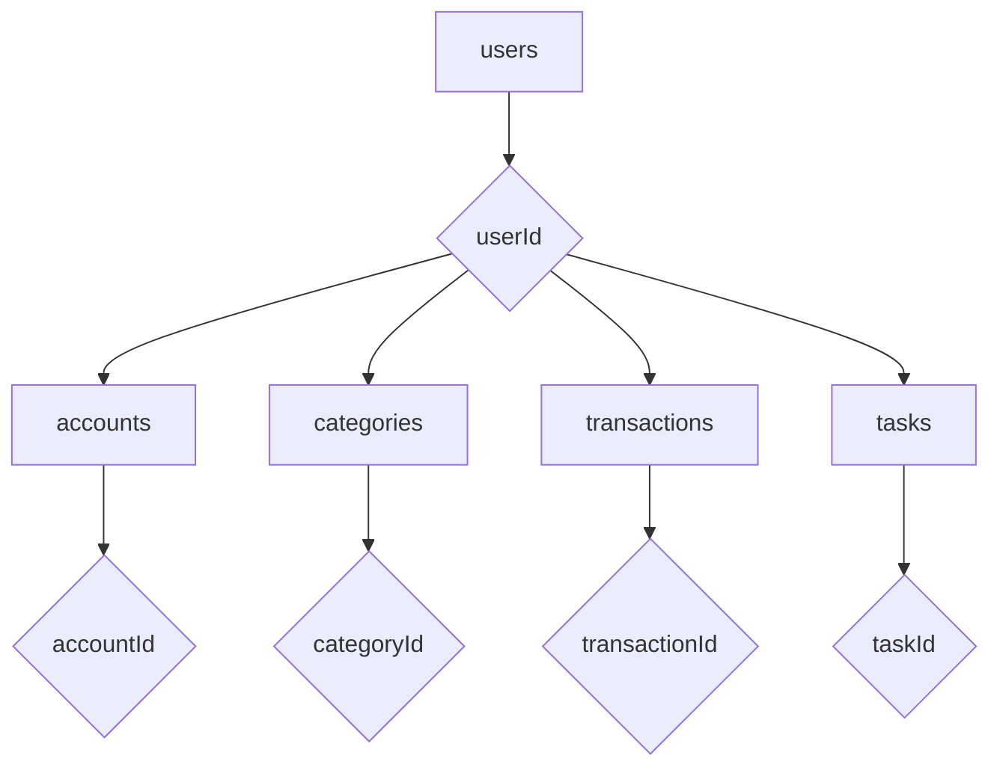

# Plan: Migrating from Drift to Firestore

This document outlines the plan for migrating the application's local database from Drift to Firestore.

## 1. Analysis of the Existing Drift Implementation

The first step is to analyze the existing Drift implementation to understand the database schema, queries, and data access patterns. This has already been completed. The database consists of four tables: `Categories`, `Transactions`, `Tasks`, and `Accounts`.

## 2. Add Firestore Dependencies

The following dependencies will be added to the `pubspec.yaml` file:

```yaml
dependencies:
  # ... other dependencies
  firebase_core: ^2.24.2
  cloud_firestore: ^4.13.1
```

## 3. Enable Offline Persistence

Offline persistence will be enabled for Firestore to ensure the application is "offline-first". This will be done in the `main.dart` file before the app starts.

```dart
void main() async {
  WidgetsFlutterBinding.ensureInitialized();
  await Firebase.initializeApp();
  FirebaseFirestore.instance.settings = Settings(persistenceEnabled: true);
  runApp(MyApp());
}
```

## 4. Create Firestore Service

A new `FirestoreService` class will be created in `lib/services/firestore_service.dart`. This class will be a singleton and will contain all the methods for interacting with the Firestore database.

## 5. Map Data Models to Firestore

New data models will be created for each of the existing Drift tables. These models will be located in `lib/models/` and will include `toJson` and `fromJson` methods for serialization and deserialization.

The Firestore data will be structured as follows:



*   `lib/models/category.dart`
*   `lib/models/transaction.dart`
*   `lib/models/task.dart`
*   `lib/models/account.dart`

## 6. Implement Firestore Methods

The `FirestoreService` will implement methods for performing CRUD operations on the Firestore database. These methods will replace the existing methods in the `AppDatabase` class. The `withConverter` method will be used to ensure type-safe operations.

## 7. Replace Drift with Firestore

All usages of the `AppDatabase` class will be replaced with the new `FirestoreService` class. This will involve updating the UI and business logic to use the new Firestore methods.

## 8. Remove Drift

Once the migration is complete and verified, the following steps will be taken to remove Drift from the project:

*   Remove the `drift` and `sqlite3_flutter_libs` packages from the `pubspec.yaml` file.
*   Delete the `lib/data/local` directory.
*   Run `flutter pub get` to update the dependencies.

## 9. Verification

The final step is to thoroughly test the application to ensure that it works as expected with the new Firestore implementation. This includes testing all features that rely on the database, such as adding, editing, and deleting transactions, accounts, and categories.
