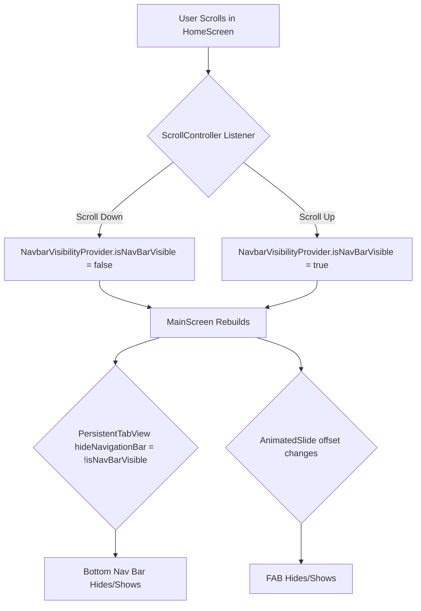

# Plan: Hide/Show Scroll Behavior for Bottom Navigation Bar and FAB

This document outlines the plan to implement a hide/show scroll behavior for the bottom navigation bar and the Floating Action Button (FAB) in `lib/screens/dashboard/main_screen.dart`.

## 1. State Management with `ChangeNotifier`

- **Create a new `ChangeNotifier`:**
  - A new file will be created at `lib/viewmodels/navbar_visibility_provider.dart`.
  - This file will contain a class `NavbarVisibilityProvider` that extends `ChangeNotifier`.
  - The provider will hold a boolean state, `isNavBarVisible`, which defaults to `true`.
  - A method, `setNavBarVisibility(bool isVisible)`, will be created to update the state and notify listeners.

## 2. Detect Scroll Direction in `home.dart`

- **Use `ScrollController` in `HomeScreen`:**
  - In `lib/screens/dashboard/navbar/home.dart`, the `_HomeScreenState` will use its existing `_scrollController`.
  - A listener will be added to the `_scrollController` in the `initState` method.
  - The listener will monitor `_scrollController.position.userScrollDirection`.
- **Update `NavbarVisibilityProvider`:**
  - When the user scrolls down (`ScrollDirection.reverse`), the `NavbarVisibilityProvider`'s `isNavBarVisible` will be set to `false`.
  - When the user scrolls up (`ScrollDirection.forward`), the `isNavBarVisible` will be set to `true`.
  - The `SingleChildScrollView` inside `_buildTransactionSectionContent` will be assigned the `_scrollController`.

## 3. Communicate State to `main_screen.dart`

- **Provide the `ChangeNotifier`:**
  - In `lib/main.dart`, the `MultiProvider` widget will be updated to include `ChangeNotifierProvider<NavbarVisibilityProvider>`.
- **Consume the `ChangeNotifier`:**
  - In `lib/screens/dashboard/main_screen.dart`, the `_MainScreenState` will access the `NavbarVisibilityProvider` using `context.watch<NavbarVisibilityProvider>()`.

## 4. Animate UI Elements in `main_screen.dart`

- **Animate the Bottom Navigation Bar:**
  - The `PersistentTabView` widget has a `hideNavigationBar` property.
  - This property will be bound to the inverse of `isNavBarVisible` from the provider (`!isNavBarVisible`).
- **Animate the Floating Action Button (FAB):**
  - The `Positioned` widget containing the FAB will be wrapped in an `AnimatedSlide` widget.
  - The `offset` of the `AnimatedSlide` will be dynamically changed based on `isNavBarVisible` to slide the FAB in and out of view. An `Offset(0, 2)` could be used to hide it, and `Offset.zero` to show it.

## Mermaid Diagram

