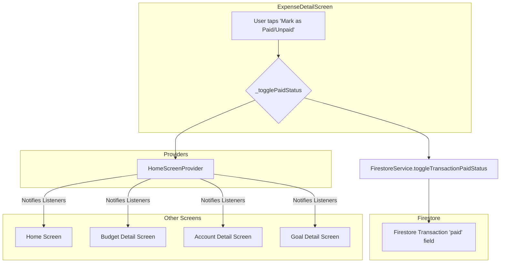

# Transaction Paid/Unpaid Status Synchronization Solution

## 1. Problem and Root Cause

**Problem:** Changes to the "paid/unpaid" status of a transaction in one detail screen are not reflected in other screens, leading to data inconsistency.

**Root Cause:** The `ExpenseDetailScreen` updates the transaction's `paid` status in Firestore but fails to notify the rest of the application. It only manages its own local state (`_isPaid`) and does not use a shared provider to signal the data change to other screens.

## 2. Proposed Solution

The solution is to leverage the existing `HomeScreenProvider` to broadcast the change in the transaction's `paid` status. This will ensure that all screens listening to this provider will be notified and can refetch the latest data, maintaining UI consistency.

### 2.1. Data Flow Diagram

Here is a Mermaid diagram illustrating the proposed data flow:



### 2.2. Code Changes

The primary change will be in `lib/screens/dashboard/navbar/home/expense_detail/expense_detail_screen.dart`.

In the `_togglePaidStatus` method, after updating Firestore, we will obtain the `HomeScreenProvider` and call `triggerTransactionsRefresh()`:

```dart
// lib/screens/dashboard/navbar/home/expense_detail/expense_detail_screen.dart

Future<void> _togglePaidStatus() async {
  if (_isUpdating) return;

  setState(() {
    _isUpdating = true;
  });

  try {
    await _firestoreService.toggleTransactionPaidStatus(
      widget.transaction.id,
      !_isPaid,
    );

    // *** NEW CODE START ***
    // Notify the rest of the app that transaction data has changed.
    if (mounted) {
      Provider.of<HomeScreenProvider>(context, listen: false)
          .triggerTransactionsRefresh();
    }
    // *** NEW CODE END ***

    setState(() {
      _isPaid = !_isPaid;
      _hasChanges = true;
      _isUpdating = false;
    });
  } catch (e) {
    print('Error toggling paid status: $e');
    setState(() {
      _isUpdating = false;
    });
  }
}
```

## 3. Visual Indicator for Paid/Unpaid Status

To provide a clear visual indicator and an intuitive way to change the status, a `Checkbox` will be added to the transaction list items in the detail screens (budget, account, and goal).

### 3.1. UI Mockup

The transaction card will be modified to include a checkbox:

```
+------------------------------------------+
| [ ] Transaction Name        $100.00      |
|     Category, Date                       |
+------------------------------------------+
```

### 3.2. Implementation

The `Checkbox` will be added to the `ListTile` or custom widget that represents a transaction.

*   The `value` of the `Checkbox` will be bound to the `transaction.paid` property.
*   The `onChanged` callback of the `Checkbox` will trigger the same `toggleTransactionPaidStatus` logic, which will now also notify the provider.

This change will need to be applied to the transaction list widgets in:

*   `lib/screens/dashboard/navbar/budget/budget_detail_screen.dart`
*   `lib/screens/dashboard/navbar/balance/balance_detail_screen.dart`
*   `lib/screens/dashboard/navbar/goals/goals_detailed/goals_detailed_screen.dart`

This ensures a consistent user experience across all detail screens.
