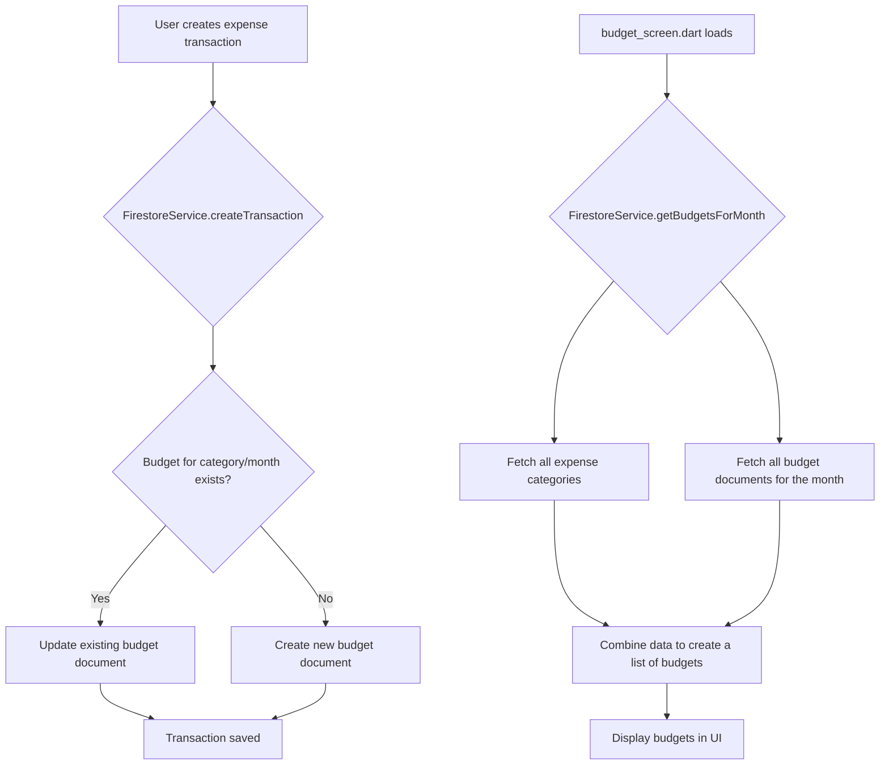

# Technical Plan: Budget Screen Revamp

This document outlines the technical plan for revamping the `budget_screen.dart` as per the new requirements.

## 1. Project Cleanup and Preparation

- **Remove `add_budget_screen.dart`**: Delete the file `lib/screens/dashboard/navbar/budget/add_budget/add_budget_screen.dart`.
- **Remove FAB from `main_screen.dart`**: In `lib/screens/dashboard/main_screen.dart`, remove the FloatingActionButton that navigates to the `AddBudgetScreen`.
- **Update Navigation**: Remove any routes or navigation logic related to `AddBudgetScreen` from the application.

## 2. Data Model and Firestore Changes

### 2.1. `Budget` Model (`lib/models/budget.dart`)

The `Budget` model will be simplified. Since budgets are now monthly and tied to expense categories, we can streamline the model.

**Proposed `Budget` Model:**

```dart
import 'package:cloud_firestore/cloud_firestore.dart';

class Budget {
  final String id; // Composite key: {userId}_{categoryId}_{year}-{month}
  final String categoryId;
  final int year;
  final int month;
  final double spentAmount;
  final String userId;

  Budget({
    required this.id,
    required this.categoryId,
    required this.year,
    required this.month,
    required this.spentAmount,
    required this.userId,
  });

  // toJson, fromFirestore, copyWith, etc.
}
```

- **`id`**: A composite key will be used to uniquely identify a budget for a specific user, category, and month (e.g., `uid_catId_2023-10`).
- **`spentAmount`**: This will track the total expenses for the category in the given month.
- **Removed Fields**: `name`, `totalAmount`, `currentAmount`, `endDate`.

### 2.2. `FirestoreTransaction` Model (`lib/models/firestore_transaction.dart`)

No changes are required for the `FirestoreTransaction` model. The `categoryId` field will be used to link transactions to the new budget structure.

### 2.3. Firestore Logic (`lib/services/firestore_service.dart`)

The `FirestoreService` will be updated to handle the new automatic budget creation and transaction association.

- **`createTransaction` Method**:
  - When an 'expense' transaction is created, check if a budget document exists for the transaction's `categoryId` and month/year.
  - If a budget document exists, atomically update the `spentAmount`.
  - If a budget document does not exist, create a new one with the transaction's amount as the initial `spentAmount`.
- **`getBudgetsForMonth` Method**:
  - Create a new method to fetch all budget documents for a given month and year. This will be used to display the budgets on the `budget_screen.dart`.
  - This method will also need to fetch all 'expense' categories to display budgets for categories with no spending yet (spentAmount = 0).

### 2.4. Data Flow

Here is a Mermaid diagram illustrating the data flow:



## 3. UI Revamp for `budget_screen.dart`

The `budget_screen.dart` will be completely redesigned.

- **Main View**:
  - A list of all 'expense' categories will be displayed.
  - Each list item will represent a budget for the current month.
  - Each item will show:
    - Category icon and name.
    - A progress bar indicating spending (since there's no limit, this will just show the amount spent).
    - The total amount spent for that category in the current month.
  - A tap on a budget item will navigate to the `budget_detail_screen` (to be created later).
- **Pie Chart**:
  - By default, the pie chart will show the breakdown of spending across all categories for the current month.
  - When a budget/category is selected from the list, the pie chart will update to show the transactions for that specific category.

## 4. State Management

We will use a `ChangeNotifierProvider` to manage the state of the `budget_screen.dart`.

- **`BudgetProvider`**:
  - This provider will be responsible for fetching and holding the budget data for the selected month.
  - It will expose:
    - A list of `Budget` objects.
    - The currently selected month and year.
    - Methods to change the month.
    - The currently selected budget for the pie chart.
  - The provider will use the `FirestoreService` to fetch the data.

## 5. Testing and Validation

- **Unit Tests**:
  - Write unit tests for the new logic in `FirestoreService`.
  - Write unit tests for the `BudgetProvider`.
- **Widget Tests**:
  - Write widget tests for the new `budget_screen.dart`.
- **Manual Testing**:
  - Thoroughly test the new budget creation and transaction flow.
  - Test the UI and state management on the `budget_screen.dart`.

This plan provides a comprehensive overview of the required changes. Are you happy with this plan, or would you like to make any adjustments?