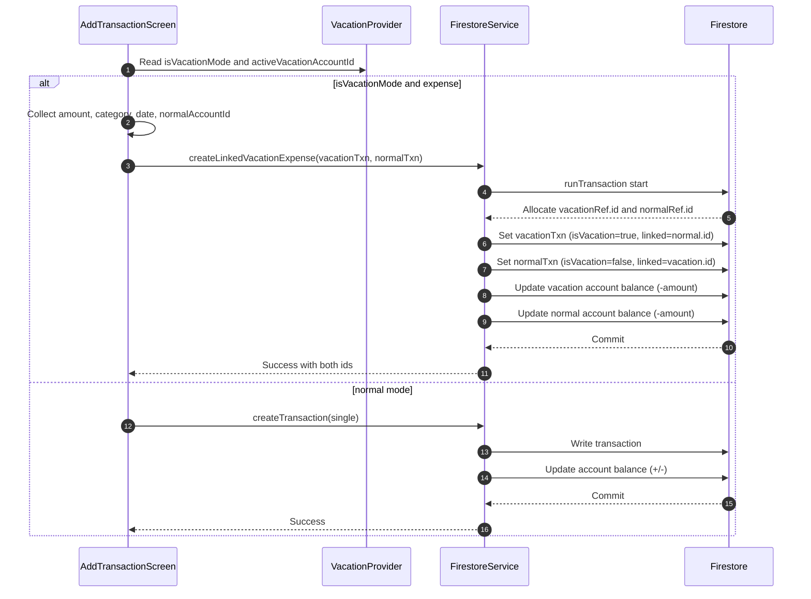

# Technical Specification: Linking Vacation Mode Transactions with Normal Accounts

## Objective

Implement a system to associate a vacation-mode expense with a regular (non-vacation) account by creating two linked transactions:
- Primary transaction in the active vacation account
- Secondary linked "ghost" transaction in a selected normal account

Both transactions must be linked via a bidirectional identifier and support cascade deletion.

## Scope and Assumptions

- Applies to expenses created while vacation mode is active.
- The active vacation account is managed by [VacationProvider](lib/viewmodels/vacation_mode_provider.dart:11) and accessed via [VacationProvider.isVacationMode](lib/viewmodels/vacation_mode_provider.dart:16) and [VacationProvider.activeVacationAccountId](lib/viewmodels/vacation_mode_provider.dart:18).
- Vacation accounts are identified by [FirestoreAccount.isVacationAccount](lib/models/firestore_account.dart:22).
- Normal (non-vacation) accounts are any accounts with `isVacationAccount != true`.
- Transaction types are [TransactionType](lib/constants/transaction_type_enum.dart:1) mapped to 'income' or 'expense' strings where required.
- Existing analytics, budgets, and goals logic are left unchanged and will count both transactions unless later refined.

## Data Model Changes

Modify [FirestoreTransaction](lib/models/firestore_transaction.dart:3) to support linking:

1. Add new field:
   - `final String? linkedTransactionId; // bidirectional link to counterpart`

2. Update constructor and serialization:
   - Extend [FirestoreTransaction.FirestoreTransaction()](lib/models/firestore_transaction.dart:23) to accept `linkedTransactionId`.
   - Include `linkedTransactionId` in [FirestoreTransaction.toJson()](lib/models/firestore_transaction.dart:45) and [FirestoreTransaction.toFirestore()](lib/models/firestore_transaction.dart:94).
   - Read `linkedTransactionId` from [FirestoreTransaction.fromFirestore()](lib/models/firestore_transaction.dart:68) and [FirestoreTransaction.fromJson()](lib/models/firestore_transaction.dart:117).

3. Update [FirestoreTransaction.copyWith()](lib/models/firestore_transaction.dart:145) to include `linkedTransactionId`.

4. Update [FirestoreTransaction.toString()](lib/models/firestore_transaction.dart:188), equality [FirestoreTransaction.operator==](lib/models/firestore_transaction.dart:193), and [FirestoreTransaction.hashCode](lib/models/firestore_transaction.dart:217) to include `linkedTransactionId`.

5. Document shape example (Firestore):
   ```
   {
     description: "Dinner",
     amount: 50.0,
     type: "expense",
     date: Timestamp(...),
     categoryId: "...",
     accountId: "...",            // vacation OR normal depending on doc
     isVacation: true|false,      // true for vacation txn, false for normal ghost
     linkedTransactionId: "..."   // id of counterpart document
     // other optional fields...
   }
   ```

Rationale:
- A single `linkedTransactionId` is sufficient and simpler than a group identifier, because there are exactly two documents in this linkage.

## UI/UX Changes in Add Transaction Screen

Target file: [add_transaction_screen.dart](lib/screens/dashboard/navbar/home/transaction/add_transaction_screen.dart:1)

### Behavior Rules

- When [VacationProvider.isVacationMode](lib/viewmodels/vacation_mode_provider.dart:16) is `true`:
  - Hide the current Account selector that lists accounts for transaction assignment (this would typically list vacation accounts when vacation mode is active).
  - Use [VacationProvider.activeVacationAccountId](lib/viewmodels/vacation_mode_provider.dart:18) implicitly as the account for the primary vacation transaction.
  - Show a new selector listing only normal accounts (where `isVacationAccount != true`). This is the account the expense is "paid from".
- When vacation mode is `false`, retain the existing behavior.

### State Additions

- Add new state in [_AddTransactionScreenState](lib/screens/dashboard/navbar/home/transaction/add_transaction_screen.dart:36):
  - `List<FirestoreAccount> _normalAccounts = [];`
  - `String? _selectedNormalAccountId;`

### Loading Accounts

Modify [_loadAccounts()](lib/screens/dashboard/navbar/home/transaction/add_transaction_screen.dart:79) to:

1. Read `vacationProvider.isVacationMode`.
2. If `true`:
   - Retrieve all accounts once via [FirestoreService.getAllAccounts()](lib/services/firestore_service.dart:710).
   - Determine `activeVacationAccountId = vacationProvider.activeVacationAccountId`.
     - If `activeVacationAccountId` is present and exists, set `_selectedAccountId = activeVacationAccountId`.
     - Do not populate `_accounts` for UI when in vacation mode; keep `_selectedAccountId` for internal use only.
   - Populate `_normalAccounts = allAccounts.where((a) => a.isVacationAccount != true).toList();`
   - Select default:
     - If there is a [FirestoreAccount.isDefault](lib/models/firestore_account.dart:20) normal account, set `_selectedNormalAccountId` to it.
     - Otherwise pick the first normal account if present.
3. If `false`:
   - Keep existing logic for normal mode (as-is).

Note: Do not patch `'account'` form field when in vacation mode. Instead, patch `'normalAccount'` to `_selectedNormalAccountId`.

### Form Fields

- Existing 'Account' field:
  - Wrap in a conditional: render only when `!vacationProvider.isVacationMode`.
- New 'Paid From Account' field (normal accounts only):
  - Render only when `vacationProvider.isVacationMode` is `true` and `widget.transactionType == TransactionType.expense`.
  - Implement as a [FormBuilderField<String>](lib/screens/dashboard/navbar/home/transaction/add_transaction_screen.dart:450) with `name: 'normalAccount'`, sourcing items from `_normalAccounts`.
  - Validation: required (must select a normal account).

### Save Button Behavior

- No change to the button; behavior handled inside [_saveTransaction()](lib/screens/dashboard/navbar/home/transaction/add_transaction_screen.dart:1309).

### Empty/Edge UI States

- If vacation mode is `true` but `activeVacationAccountId` is null, block creation and show a snackbar "No active vacation account selected".
- If `_normalAccounts` is empty, show a UI hint "Create a normal account to pay from" and block creation with validation error.

## Backend Logic

### Creation Flow

Implement linked creation atomically:

- Add a new service method in [firestore_service.dart](lib/services/firestore_service.dart:341):
  - Proposed signature (exact naming can be finalized during implementation):
    - `Future<Map<String, String>> createLinkedVacationExpense({required FirestoreTransaction vacationTxn, required FirestoreTransaction normalTxn})`
  - Responsibilities:
    - Use `_firestore.runTransaction` to:
      1. Pre-allocate two doc refs under `_transactionsCollection`:
         - `final vacationRef = _transactionsCollection.doc();`
         - `final normalRef = _transactionsCollection.doc();`
      2. Create `vacationTxn` with:
         - `id = vacationRef.id`
         - `isVacation = true`
         - `accountId = activeVacationAccountId`
         - `linkedTransactionId = normalRef.id`
      3. Create `normalTxn` with:
         - `id = normalRef.id`
         - `isVacation = false`
         - `accountId = selectedNormalAccountId`
         - `linkedTransactionId = vacationRef.id`
      4. `tx.set(vacationRef, vacationTxn.toJson())` and `tx.set(normalRef, normalTxn.toJson())`
      5. Update balances atomically:
         - Vacation account: subtract `amount` (`newBalance = currentBalance - amount`)
         - Normal account: subtract `amount` (`newBalance = currentBalance - amount`)
      6. Return both IDs.

Notes:
- This method encapsulates linked creation and ensures both documents and both balance updates succeed or fail together.

### Save Transaction Integration

Modify [_saveTransaction()](lib/screens/dashboard/navbar/home/transaction/add_transaction_screen.dart:1309) to:

1. Compute `amount`, `category`, `date`, etc. (existing code).
2. Determine `isVacationMode = Provider.of<VacationProvider>(context, listen: false).isVacationMode`.
3. Branch:
   - If `!isVacationMode`: keep existing flow (single transaction via [FirestoreService.createTransaction()](lib/services/firestore_service.dart:342), then update selected account balance).
   - If `isVacationMode` and `widget.transactionType == TransactionType.expense`:
     - Validate `activeVacationAccountId != null` and `_selectedNormalAccountId != null`; else abort with error UI.
     - Build the two `FirestoreTransaction` objects:
       - `vacationTxn`: same fields as current transaction payload, but `accountId = activeVacationAccountId`, `isVacation = true`.
       - `normalTxn`: 'expense' type, `accountId = _selectedNormalAccountId`, `isVacation = false`, mirror other fields sensibly (e.g., same category or null; same date/time; same notes).
     - Call `FirestoreService.createLinkedVacationExpense(vacationTxn: ..., normalTxn: ...)`.
     - Skip the standalone balance update in UI layer; balances are updated inside the service method’s transaction.
   - If `isVacationMode` and `widget.transactionType == TransactionType.income`:
     - Out of current feature scope; retain existing single-transaction behavior.

4. Keep existing goal progress update for incomes only (unchanged).

### Deletion Flow

Extend [FirestoreService.deleteTransaction()](lib/services/firestore_service.dart:429) to support cascade deletion:

- Inside the existing `runTransaction`:
  1. Read the target transaction doc and parse [FirestoreTransaction.linkedTransactionId](lib/models/firestore_transaction.dart:3).
  2. If `linkedTransactionId` is null/empty:
     - Retain current behavior (reverse account balance for a single transaction and delete it).
  3. If present:
     - Get `linkedRef = _transactionsCollection.doc(linkedTransactionId)` and read it.
     - For each of the two transactions:
       - Compute balance reversal delta:
         - If `type == 'income'`: `delta = -amount` (since original created balance +amount and deletion should -amount)
         - If `type == 'expense'`: `delta = +amount`
       - Update each transaction’s associated account balance accordingly (two independent account updates).
     - Delete both transaction documents: `tx.delete(transactionDocRef)` and `tx.delete(linkedRef)`.
- This preserves atomicity across both deletes and both account updates.

### Optional Refactoring

- Consider adding a dedicated method `deleteTransactionCascade(String id)` and have `deleteTransaction(id)` delegate to it for clarity, but this is optional given the current structure.

## Exact Model Changes (Summary Mapping)

Update these constructs in [FirestoreTransaction](lib/models/firestore_transaction.dart:3):

- [FirestoreTransaction.FirestoreTransaction()](lib/models/firestore_transaction.dart:23): add `String? linkedTransactionId`.
- [FirestoreTransaction.toJson()](lib/models/firestore_transaction.dart:45): include `'linkedTransactionId': linkedTransactionId`.
- [FirestoreTransaction.fromFirestore()](lib/models/firestore_transaction.dart:68): parse `linkedTransactionId`.
- [FirestoreTransaction.toFirestore()](lib/models/firestore_transaction.dart:94): include `linkedTransactionId`.
- [FirestoreTransaction.fromJson()](lib/models/firestore_transaction.dart:117): parse `linkedTransactionId`.
- [FirestoreTransaction.copyWith()](lib/models/firestore_transaction.dart:145): include `linkedTransactionId`.
- [FirestoreTransaction.toString()](lib/models/firestore_transaction.dart:188): include `linkedTransactionId`.
- [FirestoreTransaction.operator==](lib/models/firestore_transaction.dart:193): include `linkedTransactionId` in equality.
- [FirestoreTransaction.hashCode](lib/models/firestore_transaction.dart:217): include `linkedTransactionId`.

## Edge Cases and Risks

- Missing active vacation account:
  - Block creation in UI; prompt user to select or create a vacation account via [vacation_dialog.dart](lib/screens/dashboard/navbar/home/vacation_dialog.dart:15).
- No normal accounts:
  - Block with validation; guide user to create a normal account.
- Account deleted after selection but before save:
  - Service-level transaction reads will fail gracefully; surface error message and do not commit.
- Partial writes / network failure:
  - `runTransaction` ensures atomicity; either both transactions and both account updates commit or none do.
- Editing existing linked transactions:
  - Not covered in this spec; future work should enforce synchronized updates across both documents or restrict edits to prevent desynchronization.
- Toggle paid status:
  - [FirestoreService.toggleTransactionPaidStatus()](lib/services/firestore_service.dart:815) does not cascade to linked transactions. This can lead to mismatched balances if toggled on one side only. Recommendation: in future, either prevent toggling for linked pairs or cascade the toggle across both transactions inside a single transaction.
- Analytics double-counting:
  - Both transactions will be counted in their respective scopes (vacation vs normal). If consolidation is needed for reporting, add a future flag (e.g., `isGhost`) or filter by `isVacation` and/or `linkedTransactionId` in analytics queries.
- Budget/Goal implications:
  - Secondary normal account transaction may affect budgets/goals if a category is set. Recommendation: either remove `categoryId` on the ghost transaction or add a UI note. This spec keeps fields consistent; behavior can be refined later.

## Implementation Plan (Step-by-Step)

1. Data Model
   - Add `linkedTransactionId` to [FirestoreTransaction](lib/models/firestore_transaction.dart:3) and update all serializers and helpers listed above.

2. UI
   - In [_loadAccounts()](lib/screens/dashboard/navbar/home/transaction/add_transaction_screen.dart:79), implement dual-loading logic and selection defaults.
   - Hide the existing 'Account' form field when vacation mode is active.
   - Add new 'Paid From Account' field (`name: 'normalAccount'`) rendered for `isVacationMode && TransactionType.expense`.
   - Validation: ensure `_selectedNormalAccountId` is set.

3. Save Logic
   - In [_saveTransaction()](lib/screens/dashboard/navbar/home/transaction/add_transaction_screen.dart:1309), branch logic:
     - Normal mode: unchanged.
     - Vacation mode expense: build `vacationTxn` and `normalTxn` and call `FirestoreService.createLinkedVacationExpense(...)`.

4. Service
   - Implement `createLinkedVacationExpense(...)` in [firestore_service.dart](lib/services/firestore_service.dart:341):
     - Pre-allocate two doc refs, set bidirectional `linkedTransactionId`, write both docs, update both account balances within `runTransaction`.
   - Extend [deleteTransaction](lib/services/firestore_service.dart:429) to handle cascade deletion if `linkedTransactionId` exists.

5. QA and Testing
   - Unit-test service methods for:
     - Balanced atomic creation (two docs + two balance updates).
     - Cascade deletion reversal across both accounts.
   - UI tests/manual flows:
     - Vacation mode on/off matrix.
     - Missing active vacation account.
     - No normal accounts.
   - Regression tests: normal mode behavior unaffected.

## Sequence Diagram (Mermaid)



## Deletion Flow (Outline)

- User deletes either transaction in the linked pair.
- Service:
  - Detect `linkedTransactionId`.
  - In a single `runTransaction`, reverse balances for both accounts and delete both docs.

## Notes for Future Enhancements

- Consider a `isGhost` flag on the normal account transaction to exclude it from analytics.
- Provide an explicit "Transfer" type to represent cross-account balancing rather than duplicating "expense". Out of scope for this spec.